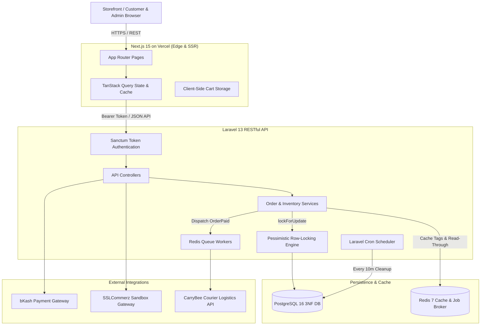

# 🛒 Single-Vendor E-Commerce Platform

[](https://www.php.net/)
[](https://laravel.com/)
[](https://nextjs.org/)
[](https://www.postgresql.org/)
[](https://redis.io/)
[](https://tailwindcss.com/)
[](https://e-com-theta-orpin-66.vercel.app/)
[](LICENSE)

> 🚀 **Live Demo:** [https://e-com-theta-orpin-66.vercel.app/](https://e-com-theta-orpin-66.vercel.app/)

A production-grade, full-stack single-vendor e-commerce platform architected with **Next.js 15 (App Router)** and **Laravel 13 REST API**. Engineered for high concurrency, zero inventory overselling via database row locking (`SELECT ... FOR UPDATE`), asynchronous courier dispatch (CarryBee), multi-provider payment idempotency (bKash & SSLCommerz), and sub-50ms catalog retrieval using tagged Redis caching.

---

## 🏛️ System Architecture



---

## 🚀 Key Architectural Features

1. **Atomic Concurrency & Zero Overselling:** Checkout transactions utilize PostgreSQL row-level pessimistic locking (`SELECT ... FOR UPDATE`) inside atomic database transactions, backed by database-level constraints `CHECK (stock >= 0)` and an immutable `inventory_logs` audit trail.
2. **Asynchronous Courier Logistics:** External courier dispatch to CarryBee is completely decoupled from the checkout request cycle using Redis queue workers with exponential backoff retries (`[10s, 60s, 300s]`).
3. **Payment Provider Strategy & Idempotency:** Implements the Strategy Pattern (`PaymentGatewayInterface`) with bKash and SSLCommerz providers. Webhook handlers enforce strict idempotency keys to eliminate double-crediting.
4. **Sub-50ms Redis Tagged Caching:** Active product catalogs and category filters are cached in Redis under `products:catalog` tags. Cache invalidation is selective via Eloquent observers (`ProductObserver`) triggered only on stock or catalog changes.
5. **Decoupled Cross-Domain Security:** Next.js frontend on Vercel (`*.vercel.app`) communicates securely with the Laravel API via Bearer token authentication in Authorization headers, eliminating third-party cookie blocking issues.
6. **Executive Business Dashboard:** Real-time KPI reporting (Gross Revenue, Net Orders, Average Order Value, Conversion Rates), 30-day dynamic revenue trend charts, and low-stock threshold monitoring.

---

## 📋 Prerequisites

Ensure your host system meets the following prerequisites:
- **PHP:** `^8.3` or `^8.4` (with `pdo_pgsql`, `redis`, `bcmath`, `curl`, `mbstring`, `zip`)
- **Composer:** `^2.7`
- **Node.js:** `^20.0` or `^22.0` (LTS) & `npm ^10.0`
- **Docker & Docker Compose:** Docker Engine 24+ (to run PostgreSQL 16 & Redis 7)

---

## 🛠️ Step-by-Step Fresh Clone Setup

### 1. Clone the Repository
```bash
git clone https://github.com/monourhosan/E_com.git
cd E_com
```

### 2. Start PostgreSQL & Redis via Docker
From the project root:
```bash
docker compose up -d
```
*This launches:*
- **PostgreSQL 16:** `localhost:5432` (Database: `ecommerce`, User: `postgres`, Password: `password`)
- **Redis 7:** `localhost:6379` (Default database: `0`)

Verify containers are healthy:
```bash
docker compose ps
```

---

### 3. Backend Setup (Laravel 13 API)

Navigate into `backend/`:
```bash
cd backend
```

Install PHP dependencies:
```bash
composer install
```

Set up environment variables:
```bash
cp .env.example .env
php artisan key:generate
```

Verify your `.env` contains the correct database and cache configuration:
```env
APP_NAME="Single Vendor E-Commerce"
APP_ENV=local
APP_KEY=base64:...
APP_DEBUG=true
APP_URL=http://localhost:8000
FRONTEND_URL=http://localhost:3000

DB_CONNECTION=pgsql
DB_HOST=127.0.0.1
DB_PORT=5432
DB_DATABASE=ecommerce
DB_USERNAME=postgres
DB_PASSWORD=password

QUEUE_CONNECTION=redis
CACHE_STORE=redis
REDIS_CLIENT=phpredis
REDIS_HOST=127.0.0.1
REDIS_PORT=6379

CARRYBEE_API_URL=https://api.carrybee.com/v1
CARRYBEE_CLIENT_ID=sandbox_client_id
CARRYBEE_CLIENT_SECRET=sandbox_client_secret
CARRYBEE_STORE_ID=store_main_01
```

Run database migrations and seed realistic sample data (includes 100 historical orders, products, and categories):
```bash
php artisan migrate:fresh --seed
```

Start the Redis queue worker for delivery dispatches:
```bash
# In a dedicated terminal or background process:
php artisan queue:work redis --queue=deliveries,default
```

Start the Laravel local development server:
```bash
# In another terminal:
php artisan serve --port=8000
```
Backend API will be accessible at: `http://localhost:8000` (Health check: `http://localhost:8000/api/v1/health`).

---

### 4. Frontend Setup (Next.js 15)

Open a new terminal and navigate into `frontend/`:
```bash
cd frontend
```

Install Node dependencies:
```bash
npm install
```

Configure local environment variables:
```bash
cp .env.local.example .env.local
```
Ensure `frontend/.env.local` contains:
```env
NEXT_PUBLIC_API_URL=http://localhost:8000/api/v1
NEXT_PUBLIC_APP_URL=http://localhost:3000
```

Start the Next.js development server:
```bash
npm run dev
```

The storefront will be live at: **`http://localhost:3000`**  
The admin panel will be live at: **`http://localhost:3000/admin/login`**

---

## 🔑 Default Credentials

The database seeder provisions two default accounts for immediate testing:

| Role | Email | Password | Permissions |
| :--- | :--- | :--- | :--- |
| **Store Administrator** | `admin@store.com` | `Password123!` | Full Admin Panel access, KPI Dashboard, Orders, Inventory, Payment Settings |
| **Standard Customer** | `customer@store.com` | `Password123!` | Storefront browsing, Add to Cart, Atomic Checkout, Order Confirmation |

---

## 🧪 Running Automated Tests

The backend includes a comprehensive Pest/PHPUnit test suite covering authentication, product catalog, atomic checkout row-locking, payment webhook idempotency, asynchronous CarryBee courier dispatch, and inventory audit trails.

Run the test suite inside `backend/`:
```bash
cd backend
php artisan test
```

To run individual test groups:
```bash
# Test atomic stock concurrency & row locking
php artisan test --filter=OrderCheckoutTest

# Test payment gateway strategy & idempotency
php artisan test --filter=PaymentGatewayTest

# Test CarryBee asynchronous dispatch queue
php artisan test --filter=CarryBeeDeliveryJobTest
```

---

## 💳 Payment Gateway Sandbox Credentials

You can toggle and configure payment gateways dynamically from **Admin -> Settings -> Payment Gateways** or via `.env`.

### 1. Cash on Delivery (COD)
- Fully functional without third-party credentials.
- Order is placed immediately in `pending` payment status; admin can transition to `paid` upon delivery.

### 2. bKash Sandbox (Demo Mode)
- **Merchant Number:** `01770618575`
- **Customer Sandbox Wallet:** `01770618576`
- **OTP:** `123456`
- **PIN:** `12345`

### 3. SSLCommerz Sandbox (Demo Mode)
- **Store ID:** `testbox`
- **Store Password:** `qwerty`
- **Test Cards:** Visa / Mastercard sandbox numbers with any future expiry date and CVV `123`.

---

## 📦 CarryBee Courier Dispatch Workflow

1. When an order is marked as `paid` (either through payment gateway webhook or admin manual confirmation), the application fires the `OrderPaid` event.
2. The `DispatchToCarryBeeListener` queues a `CreateCarryBeeOrderJob` onto the Redis `deliveries` queue.
3. The job connects to the CarryBee API, authenticates, and dispatches the parcel.
4. On success, the response sets the order's `consignment_id`, `tracking_code`, and updates status to `shipped`.
5. If the CarryBee API encounters network failure or HTTP 5xx errors, it automatically retries with exponential backoff:
   ```php
   public int $tries = 3;
   public array $backoff = [10, 60, 300]; // 10s, 1min, 5min
   ```
6. In local sandbox environments without live credentials, the service simulates realistic courier payloads to allow end-to-end testing without external API credentials.

---

## 🌐 Deploying Frontend to Vercel

The frontend is fully configured for deployment on [Vercel](https://vercel.com/):

1. Push your code to GitHub.
2. Import your repository into Vercel.
3. Select **`frontend`** as the **Root Directory**.
4. Configure the following **Environment Variables** in the Vercel project settings:
   - `NEXT_PUBLIC_API_URL`: Your production Laravel API URL (e.g., `https://api.yourdomain.com/api/v1`)
   - `NEXT_PUBLIC_APP_URL`: Your Vercel frontend URL (e.g., `https://e-com-store.vercel.app`)
5. Deploy! Next.js will build statically optimized pages with SSR hydration.
6. In your backend `.env`, set:
   ```env
   FRONTEND_URL=https://e-com-store.vercel.app
   ```
   *Note: `backend/config/cors.php` automatically whitelists `https://*.vercel.app` and `https://*.vercel.com` with credential support.*

---

## 📚 Technical Documentation & Defense

For an exhaustive architectural breakdown, rationale for design trade-offs, database indexing strategies, and answers to all evaluation criteria:
- **[NOTES.md](NOTES.md):** Deep-dive engineering notes covering concurrency, database schemas, queue resilience, and future production roadmap.
- **[EVALUATION_QA.md](EVALUATION_QA.md):** Comprehensive answers to all rubric evaluation questions.

---

## 🌐 Live Website

https://e-com-theta-orpin-66.vercel.app/

---

## 👨‍💻 Author

**Monour Hosan Saif**

GitHub: https://github.com/monourhosan

---

## 📄 License

This project is licensed under the MIT License.
